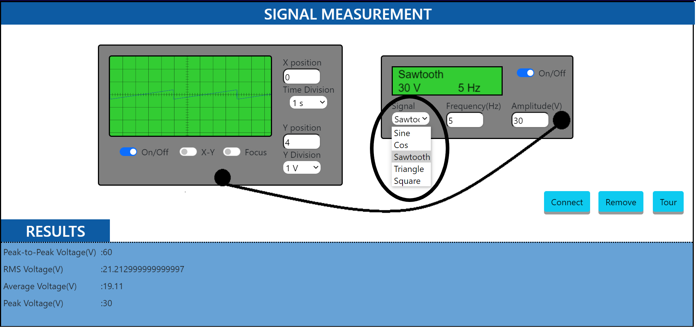
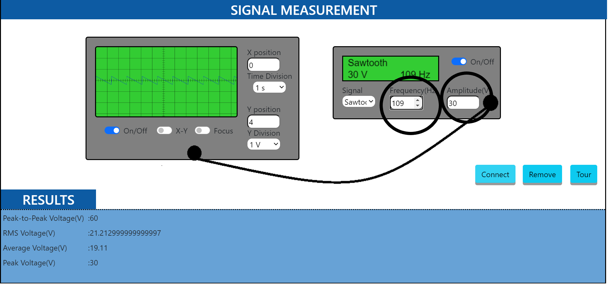
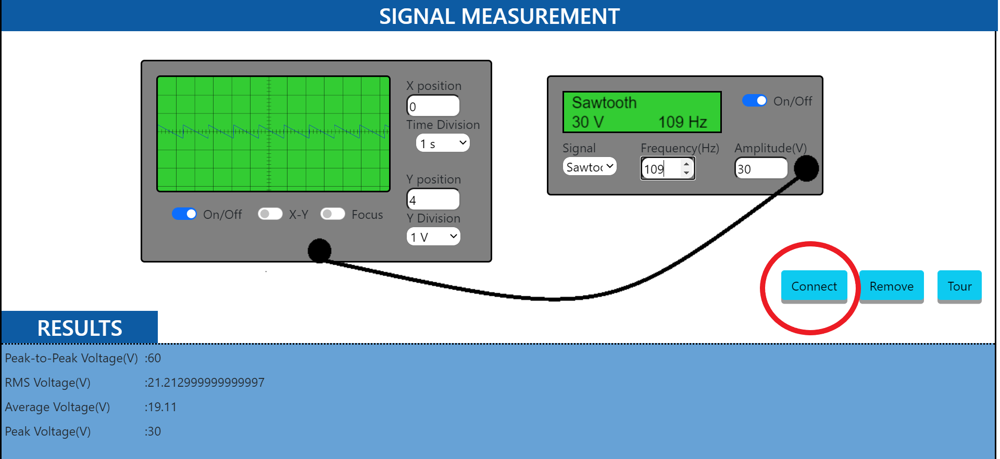
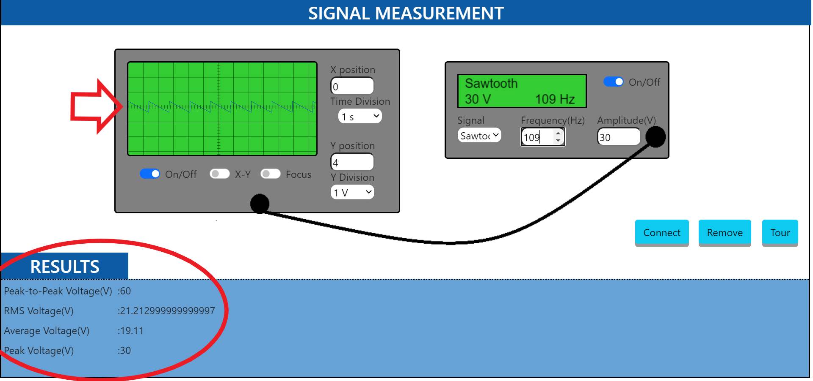

#### These procedure will be followed on the simulator:

1. After going through the theory and pretest click on the "simulator tab"
2. Select the waveform type to be generated by clicking on the function generator.

  

3. Set the frequency and amplitude of the wave by clicking on the frequency and amplitude button on the function generator.

  

4. Connect the probe of function generator to CRO to visualise the wave generated.

  

5. Note the characteristics such as peak-to-peak voltage, time period with the help of CRO.

  

